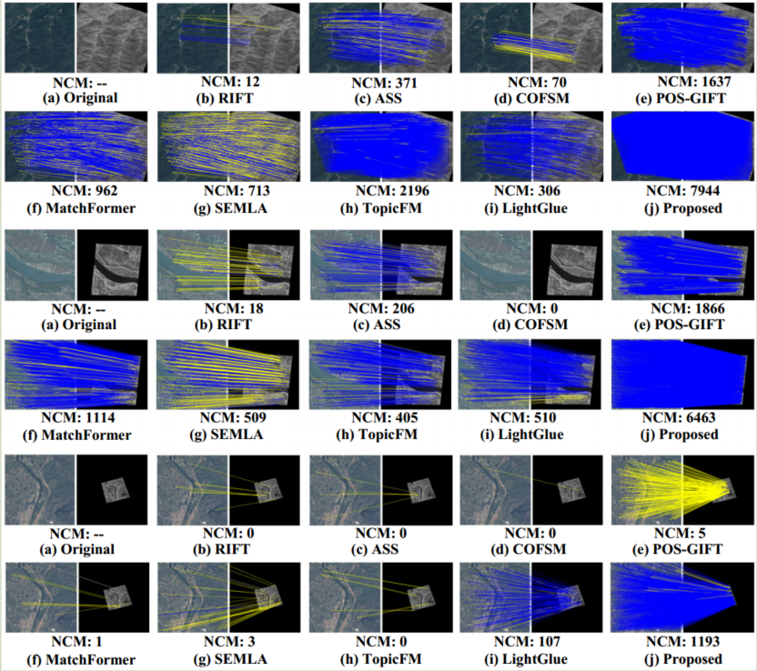

# AMS_Former
This is the official code for AMS_Former.


# Results


## Installation (Only Linux)

```pip install -r requirements.txt```

# Download weights
https://pan.baidu.com/s/1B6y9SyU0EAWCA0UwcyRBwQ?pwd=dapr

Download and extract it, and place it in the root directory.

# Download datasets
Download datasets：https://pan.baidu.com/s/1NIHlmTg34VVsedGOSzbkiw?pwd=rkei 

Download and extract it, and place it in the root directory.

# Test

For RGB-NIR:
``` python test.py --ref_dir datasets/RGB-NIR/RGB --sen_dir datasets/RGB-NIR/NIR --json_path datasets/RGB-NIR/trans_info.json --results_dir results/RGB-NIR --mode mode1```
The results will be saved at "results/RGB-NIR"

For SGM-SM:
``` python test.py --ref_dir datasets/SGM-SM/SGM --sen_dir datasets/SGM-SM/SM --json_path datasets/SGM-SM/trans_info.json --results_dir results/SGM-SM --mode mode2```
The results will be saved at "results/SGM-SM"

For RGB-LWIR:
``` python test.py --ref_dir datasets/RGB-LWIR/RGB --sen_dir datasets/RGB-LWIR/LWIR --json_path datasets/RGB-LWIR/trans_info.json --results_dir results/RGB-LWIR --mode mode3```
The results will be saved at "results/RGB-NIR"

For RGB-Ndepth:
``` python test.py --ref_dir datasets/RGB-Ndepth/RGB --sen_dir datasets/RGB-Ndepth/Ndepth --json_path datasets/RGB-Ndepth/trans_info.json --results_dir results/RGB-Ndepth --mode mode1```
The results will be saved at "results/RGB-NIR"

For RGB-RGB:
``` python test.py --ref_dir datasets/RGB-RGB/RGB1 --sen_dir datasets/RGB-RGB/NIR2 --json_path datasets/RGB-RGB/trans_info.json --results_dir results/RGB-RGB --mode mode1```
The results will be saved at "results/RGB-RGB"
