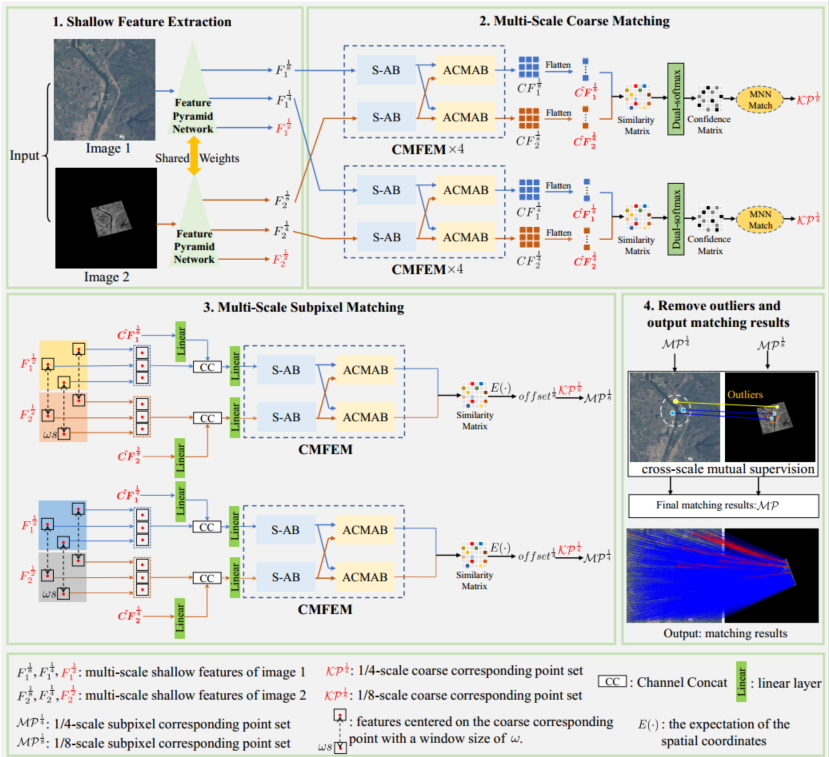
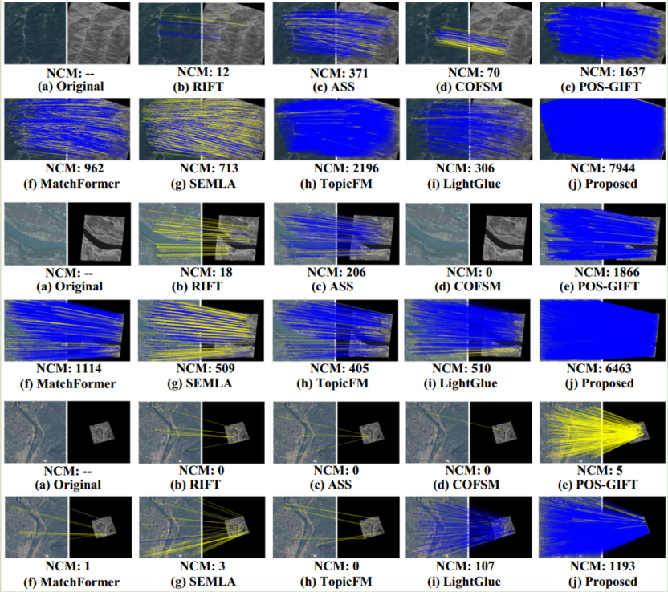

# AMS_Former
This is the official code for AMS_Former. https://www.sciencedirect.com/science/article/pii/S0924271626000213


# Results


## Installation (Only Linux)

```pip install -r requirements.txt```

# Download weights

Download datasets：https://pan.baidu.com/s/1r3ZRlB2RIX98i0UG4j5ZRA?pwd=5m9j

Please download and extract it, then rename `AMS_weights` to `weights` and place it in the project root directory.


# Download datasets
https://pan.baidu.com/s/1sEE5RknBj4RMZk4SC3UOjQ?pwd=tgxq

# Test

For RGB-NIR:
```
python test.py \
    --ref_dir AMS_datasets/rgb_nir/rgb \
    --sen_dir AMS_datasets/rgb_nir/nir \
    --json_path trans_info.json \
    --result_dir results/rgb_nir \
    --mode mode1 \
    --match_thresold 3 \
    --device cuda
```
For SGM-SM:
```
python test.py \
    --ref_dir AMS_datasets/sgm_sm/sgm \
    --sen_dir AMS_datasets/sgm_sm/sm \
    --json_path trans_info.json \
    --result_dir results/sgm_sm \
    --mode mode2 \
    --match_thresold 3 \
    --device cuda
```
For RGB-LWIR:
```
python test.py \
    --ref_dir AMS_datasets/rgb_lwir/rgb \
    --sen_dir AMS_datasets/rgb_lwir/lwir \
    --json_path trans_info.json \
    --result_dir results/rgb_lwir \
    --mode mode3 \
    --match_thresold 3 \
    --device cuda
```
For RGB-NDepth:
```
python test.py \
    --ref_dir AMS_datasets/rgb_depth/rgb \
    --sen_dir AMS_datasets/rgb_depth/depth \
    --json_path trans_info.json \
    --result_dir results/rgb_depth \
    --mode mode1 \
    --match_thresold 3 \
    --device cuda
```


## Thank you！
If you find our code useful, please consider adding the following citation:

```bibtex
@article{RAO2026957,
title = {AMS-Former: Adaptive multi-scale transformer for multi-modal image matching},
journal = {ISPRS Journal of Photogrammetry and Remote Sensing},
volume = {232},
pages = {957-973},
year = {2026},
issn = {0924-2716},
author = {Jiahao Rao and Rui Liu and Jianjun Guan and Xin Tian},
}
